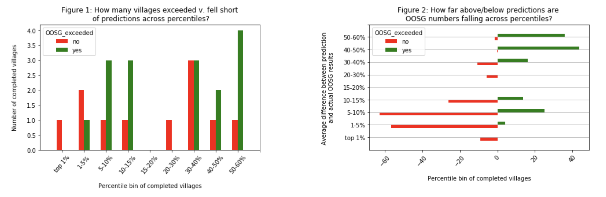
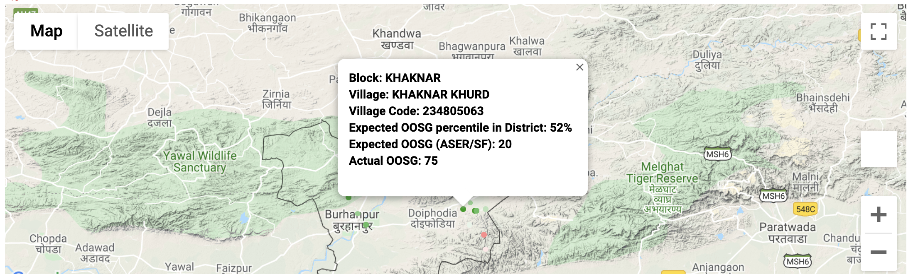

# NGO_dashboard
This repo contains a dashboard that is designed to monitor incoming survey results from an education NGO's door-to-door survey (D2D) and identify areas where adjustments to their targeting approach could save resources. The NGO finds and renrolls out of school girls (OOSGs) across northern India, and is looking to expand their program to 2500 new villages across Madhya Pradesh and Uttar Pradesh. From historic expansion we know that 95% of out of school girls typically live in 50% of villages, but without doing time intensive surveying in every village in northern India it has historically not been possible to identify and target these high priority regions.

To help reach more out of school girls, we have designed a series of machine learning algorithms that predict which villages will have the most OOSGs and identifies the optimal clustering of villages for expansion, taking into account the NGO's operational constraints. By targeting the regional hotspots of low school enrollment instead of selecting areas for expansion at random, the NGO is able to reach 50% more OOSGs without increasing program costs. 

This dashboard is designed to monitor the latest round of expansion in the 2500 villages which we've recommended. Due to limitations in our machine learning training data (ex. administrative data in India from the census is from 2011, our outcome variable excluded ages 5-6, etc.), we expect some predictions to be off and want to closely monitor the incoming results. The purpose of this dashboard is to monitor survey progress and the assumptions/extrapolations we had to make in our predictions and triage which trends are unlikely to improve with more surveying and which are not. We will use this to dentify areas where early adjustments to expansion recommendations could save the NGO time and resources.

The colors used across the dashbaoard are consistent and designed to be intuitive - <font color='green' size = '3'>green</font> highlights positive trends that will help the NGO exceed their 44 OOSG/village target and <font color='red' size = '3'>red</font> highlights concerning trends that could make them fall short.

## Prerequisites
This dashboard was written using the following version of python:
```
python --version
python 3.6.8
```
It has the following dependencies:
```
pandas
geopandas
numpy
math
sqalchemy
datetime
matplotlib
webcolors
maplotlib
webcolors
gmaps
ipywidgets

```
All packages are downloadable on the command line using either conda or pip:
```
conda install package_name
pip install package_name
```

## Functionality
The dashboard is designed to pull in live survey data from a remote SQL database and merge this with local machine learning predictions. It performs a comprehensive set of analyses comparing ground truthed results to predictions, and visualizes the results in a set of intuitive graphs and interactive maps. 

The dashboard is generated by running the Dashboard.ipynb file. The last cell of this notebook exports the notebook to a stable html file (Dashboard.html) with all interactive maps and figures plotted inline. _The .html file is openable by all users regardless of whether they have python installed on their computers, making it easy to share with non-technical teams._

## How to open Dashboard.html
To open the dashboard without python installed simply download the .html file and double click on the file to open it in your browser. The interactive maps only open in chrome due to a widget issue. If the .html file does not open, this is likely due to the security settings of the browser and needs to be resolved locally.

**NOTE**: Except for the interactive maps, you can view the Dashboard.ipynb on the GitHub website itself. To view the interactive maps you will need to download the .html file or all necessary package dependencies and run the notebook from scratch.

If the dashboard opens properly you should both see figures such as the below:


And interactive google maps (with clickable points) such as the below:

